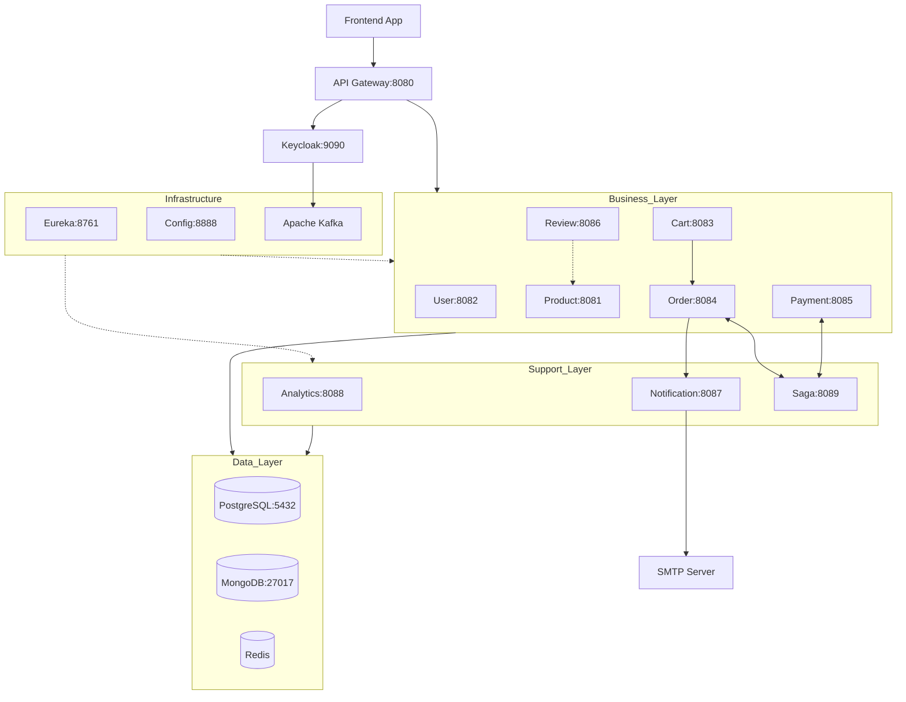
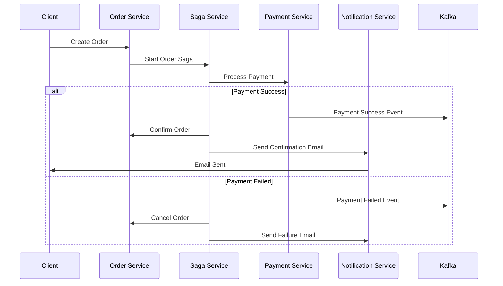

# SpringMarket (Wildberries-like)
## 🚀 Основные возможности

- **Каталог товаров** с расширенной фильтрацией и пагинацией
- **OAuth2 аутентификация** через Keycloak
- **Микросервисная архитектура** с Event-Driven подходом
- **Система заказов** с оркестрацией через Saga Pattern
- **Аналитика** в реальном времени
- **Уведомления** по электронной почте
- **Отзывы и рейтинги** товаров
- **Корзина покупок** с персистентностью
- **Система платежей** с обработкой транзакций

## 🏗️ Архитектура

### Микросервисы

| Сервис                   | Описание                          | База данных        | Порт |
|--------------------------|-----------------------------------|--------------------|------|
| **Config Server**        | Централизованная конфигурация     | -                  | 8888 |
| **Discovery Server**     | Eureka service registry           | -                  | 8761 |
| **API Gateway**          | Маршрутизация и валидация токенов | -                  | 8080 |
| **Product Service**      | Управление каталогом товаров      | PostgreSQL/MongoDB | 8081 |
| **User Service**         | Управление пользователями         | PostgreSQL/MongoDB | 8086 |
| **Cart Service**         | Корзина покупок                   | PostgreSQL/MongoDB | 8084 |
| **Category Service**     | Корзина покупок                   | PostgreSQL/MongoDB | 8091 |
| **Order Service**        | Обработка заказов                 | PostgreSQL/MongoDB | 8082 |
| **Payment Service**      | Обработка платежей                | PostgreSQL/MongoDB | 8088 |
| **Inventory Service**    | Остатки, резервирование, списание | PostgreSQL/MongoDB | 8087 |
| **Review Service**       | Отзывы и рейтинги                 | PostgreSQL/MongoDB | 8083 |
| **Notification Service** | Email уведомления                 | -                  | 8089 |
| **Analytics Service**    | Сбор и анализ данных              | Redis              | 8085 |
| **Saga Service**         | Оркестрация транзакций            | -                  | 8090 |

### Архитектурная диаграмма



## 🛠️ Технологический стек

### Backend
- **Java 21**
- **Spring Boot 3.4.5**
- **Spring Cloud Gateway** - API Gateway
- **Spring Cloud Config** - Централизованная конфигурация
- **Spring Cloud Netflix Eureka** - Service Discovery
- **Spring Data JPA** - ORM для реляционных БД
- **Spring Data MongoDB** - ODM для документных БД
- **Spring Security** - Безопасность
- **OAuth2** + **Keycloak** - Аутентификация и авторизация
- **JWT** - Токены доступа

### Messaging & Events
- **Apache Kafka** - Event Streaming
- **Kafka-Keycloak Library** - Интеграция с Keycloak events

### Databases & Cache
- **PostgreSQL** - Основная реляционная БД
- **MongoDB** - Документная БД
- **Redis** - Кэш и аналитика

### Architecture Patterns
- **CQRS** (Command Query Responsibility Segregation)
- **Event-Driven Architecture**
- **Saga Pattern** - Распределенные транзакции
- **Circuit Breaker** + **Retry** (Resilience4j)

### DevOps & Tools
- **Docker** + **Docker Compose** - Контейнеризация
- **Flyway** - Миграции БД
- **Lombok** - Упрощение кода
- **OpenFeign** - HTTP клиент

### Testing
- **JUnit 5** - Unit тесты
- **Mockito** - Моки
- **Testcontainers** - Интеграционные тесты

## 🚀 Быстрый старт

### Предварительные требования

- Java 21+
- Docker & Docker Compose
- Maven 3.6+

### Установка и запуск

1. **Клонирование репозитория**
```bash
  git clone https://github.com/Cryptic901/SpringMarket.git
```

2. **Сборка проекта**
```bash
  mvn clean package -DskipTests
```

3. **Запуск через Docker Compose**
```bash
  docker-compose up -d
```

4. **Проверка состояния сервисов**
```bash
  # Discovery Server
  http://localhost:8761/actuator/health

  # API Gateway
  http://localhost:8080/actuator/health

  # Keycloak Admin Console
  http://localhost:9090/admin
```

### Конфигурация профилей

Проект поддерживает различные профили для гибкой настройки:

- `jpa` - Использование Spring Data JPA + PostgreSQL
- `mongo` - Использование Spring Data MongoDB
- `dev` - Разработка (локальная конфигурация)
- `prod` - Продакшн (конфигурация из GitHub)
- `cache` - Использование кэша Redis
- `eureka` - Регистрация в Eureka
- `feign` - Использование Spring Cloud OpenFeign для Http запросов
- `kafka` - Использование Spring Kafka в качестве брокера сообщений
- `security` - Использование Oauth2 в качестве защиты

## 📁 Структура проекта

```
├── services/                 # Микросервисы
    ├── ConfigServer/             # Сервер конфигураций
    ├── EurekaServer/             # Eureka Discovery
    ├── Gateway/                  # API Gateway
    ├── ProductService/           # Сервис товаров
    ├── UserService/              # Сервис пользователей
    ├── CartService/              # Сервис корзины
    ├── OrderService/             # Сервис заказов
    ├── PaymentService/           # Сервис платежей
    ├── ReviewService/            # Сервис отзывов
    ├── NotificationService/      # Сервис уведомлений
    ├── AnalyticService/          # Сервис аналитики
    ├── SagaService/              # Saga оркестратор
├── config/                    # Конфигурационные файлы
├── providers/                 # Файлы SPI
├── libraries/                 # Написанные библиотеки для приложения
├── docker-compose.yml         # Docker Compose конфигурация
├── init-db.sql                # SQL-скрипт для инициализации баз данных
└── pom.xml                    # BOM родительский POM
```

## 🔧 Конфигурация

### Environment Variables

| Переменная                | Описание          | По умолчанию                               |
|---------------------------|-------------------|--------------------------------------------|
| `CONFIG_SERVER_URL`       | URL Config Server | http://localhost:8888                      |
| `EUREKA_SERVER_URL`       | URL Eureka Server | http://localhost:8761                      |
| `KEYCLOAK_SERVER_URL`     | URL Keycloak      | http://localhost:9090                      |
| `KAFKA_BOOTSTRAP_SERVERS` | Kafka brokers     | localhost:9092                             |
| `DATABASE_URL`            | PostgreSQL URL    | jdbc:postgresql://localhost:5432/ecommerce |
| `REDIS_URL`               | Redis URL         | redis://localhost:6379                     |
| `MONGODB_URI`             | MongoDB URI       | mongodb://localhost:27017/ecommerce        |

## 🔄 Saga Pattern Flow

Обработка заказа через Saga:



## 📊 API Документация

После запуска сервисов, Swagger UI доступен по адресам:

- API Gateway: `http://localhost:8080/swagger-ui.html`
- Product Service: `http://localhost:8081/swagger-ui.html`
- Order Service: `http://localhost:8084/swagger-ui.html`

## 🧪 Тестирование

### Unit тесты
```bash
  mvn test
```

### Интеграционные тесты (с Testcontainers)
```bash
  mvn verify -P integration-tests
```

### Тестирование конкретного сервиса
```bash
  cd product-service
  mvn test
```

## 🔒 Безопасность

- **OAuth2** + **Keycloak** для аутентификации
- **JWT** токены для авторизации
- **Spring Security** для защиты endpoints
- **Rate Limiting** через API Gateway
- **Input Validation** во всех сервисах

## 📈 Мониторинг и Observability

- **Spring Boot Actuator** - health checks и метрики
- **Micrometer** - метрики приложений
- **Circuit Breaker** - отказоустойчивость
- **Distributed Tracing** готов к интеграции

## 👨‍💻 Автор

Создано с ❤️ для изучения современных архитектурных паттернов и технологий Spring ecosystem.